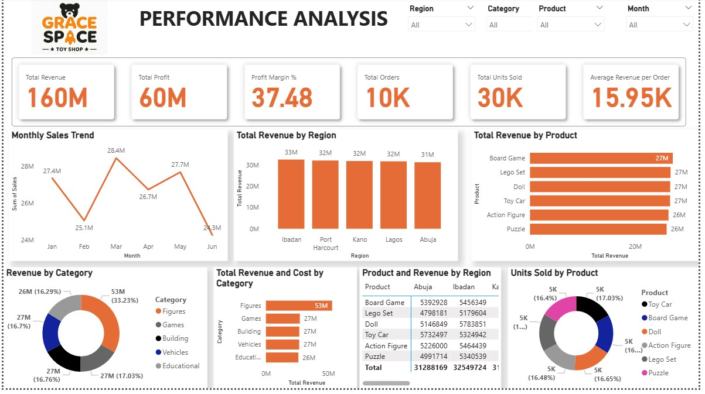

# Gracespacedashboard
The goal is to analyze historical sales data to identify trends and patterns then make recommendations to Management.

# PROBLEM STATEMENT 
A retail toy shop (GRACE SPACE) operating across multiple cities is experiencing fluctuations in sales and profitability. Management lacks clear visibility into which products, categories, and regions are driving performance.

As a Junior Data Analyst, your responsibility is to:
•Analyze historical sales data to identify trends and patterns
•Evaluate product and category performance
•Measure profitability across different regions
•Build an interactive dashboard for business stakeholders
•Provide actionable recommendations to improve revenue and operational efficiency

## VISUALIZATION

# Insights
Key Performance Indicators
Total Revenue	₦160M
Total Profit	₦60M
Profit Margin	37.48%
Total Orders	10K
Units Sold	30K
Avg Order Value ₦15.95K

The business generated ₦160M in revenue with a 37.48% profit margin across 10,000 orders and five Nigerian cities. While headline numbers are healthy, the analysis below surfaces performance gaps that, if addressed, can meaningfully improve revenue and operational efficiency in H2.

•	Revenue peaked at ₦28.4M in March and dipped to ₦24.3M in June — a 14.4% month-on-month decline.
•	Ibadan leads all regions at ₦33M; Abuja lags at ₦31M despite its purchasing power.
•	The Figures category dominates at ₦53M (33.23%) — more than double any other category.
•	All 6 products are nearly identical in revenue (₦26M–₦27M) and units sold (~5K each).
•	Profit margin sits at 37.48% overall — healthy, but unevenness by region/category likely exists.

#  Recommendations

01	Investigate the February & June Revenue Dips
Revenue dropped from ₦28M (Jan) to ₦25.1M (Feb) and again from ₦27.7M (May) to ₦24.3M (Jun) — the lowest month recorded. Management should investigate whether this reflects seasonal demand, stockouts, or reduced promotional activity, and plan interventions ahead of these months in H2.

02	Ibadan & Port Harcourt Lead — Reinforce That Position
Ibadan (₦33M) and Port Harcourt (₦32M) are the top two revenue-generating cities. Prioritise consistent stock availability and loyalty/promotional programmes in these markets before expanding effort elsewhere.

03	Abuja Underperforms — Diagnose Before Investing
Abuja sits last at ₦31M despite being Nigeria's capital and a high-purchasing-power market. This warrants investigation — is it a distribution issue, low brand awareness, or a product-market fit problem? Do not increase spend there until the root cause is clear.

04	Figures Category is Carrying the Business — Reduce Over-Reliance
Figures accounts for ₦53M (33.23%) of revenue and dominates the Revenue vs Cost chart. Heavy concentration in one category is a risk. Games, Building, Vehicles, and Educational are all clustered around ₦26–27M — there is room to grow these with targeted promotions to build a more resilient revenue mix.

05	Product Performance is Dangerously Even — Find Your Star
All 6 products sit between ₦26M–₦27M in revenue. There is no standout hero product to anchor marketing around. A pricing or bundling experiment could help identify which product has the most elastic demand and convert it into a clear revenue leader.

06	Units Sold is Flat Across Products — Use Pricing as a Lever
Each product moves roughly 5,000 units (16–17% share each). Combined with flat revenue, this suggests pricing — not demand — is the lever to pull. A controlled price increase on 1–2 products with inelastic demand could improve margins without hurting volume.

#  Risks to Watch

⚠ June's ₦24.3M is the lowest month — if this is the start of a downward trend rather than a seasonal dip, it needs immediate attention.
⚠ Over-dependence on the Figures category — 1 in 3 revenue naira comes from a single category.
⚠ No product differentiation makes the brand vulnerable if a competitor targets any single category.
⚠ Dataset covers Jan–Jun 2024 only — a full-year view would strengthen these findings.

# Immediate Next Steps

Priority	Action	Owner
🔴 High	Investigate June revenue decline — demand or supply side?	Sales & Operations
🔴 High	Run stockout audit for Ibadan and Port Harcourt	Operations
🔴 High	Commission Abuja market diagnostic	Regional Sales Lead
🟡 Medium	Design bundling/pricing experiment across all 6 products	Product & Marketing
🟡 Medium	Build category diversification plan to reduce Figures dependency	Strategy
🟢 Low	Develop H2 demand calendar using H1 trend data	Analytics

